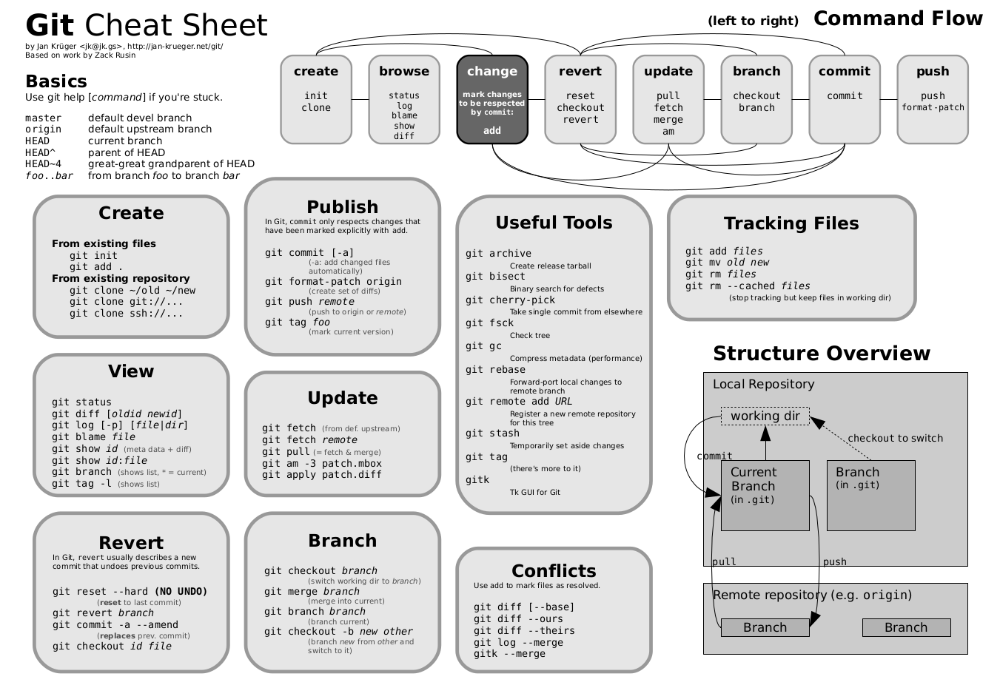

# Como Aprender os comandos do Git

Pequeno tutorial para aprender os comandos GIT.

## 0. Baseado nos seguintes tutoriais

- https://gitlab.c3sl.ufpr.br/brunaw/git-tutorial/
- https://gitlab.c3sl.ufpr.br/pet-estatistica/apostila-git/
- https://jan-krueger.net/wordpress/wp-content/uploads/2007/09/git-cheat-sheet.pdf

## 1. Resumo dos comandos

## 2. Visão Geral

